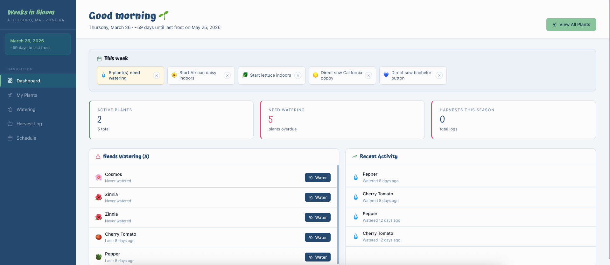

# Weeks in Bloom



A personal garden planning and tracking app — built as part of my development portfolio to solve a real problem: I had a growing list of seeds I wanted to plant this spring and no good way to manage all of it.

Weeks in Bloom turns that seed list into a full garden management system. Log when and where each seed is planted, track watering schedules, record harvests, and get a weekly to-do list so nothing falls through the cracks.

---

## About This Project

This is one of several projects in my portfolio demonstrating full-stack development with modern tooling. Weeks in Bloom is intentionally personal — it's pre-loaded with my actual 2026 seed list for Attleboro, MA (Zone 6a) — but the architecture is generalizable to any tracking/logging application.

**Stack:** React + Vite · Node.js/Express · Firestore · Google Cloud Storage · Cloud Run

---

## What It Does

- **Seed catalog** — pre-loaded with this spring's seeds, searchable for quick-fill when logging new plants
- **Plant tracker** — log each plant with status, location, and key dates (seeded, germinated, transplanted)
- **Watering log** — record every watering event; visual progress bars show who's overdue at a glance
- **Harvest log** — track quantity and unit per harvest, with per-plant season summaries
- **Schedule view** — Gantt-style calendar showing the full arc from indoor start through transplant to harvest
- **Dashboard** — overdue watering alerts, recent activity feed, and a weekly to-do list
- **Photo uploads** — attach photos to plants, stored in Cloud Storage

---

## Project Structure

```
weeks-in-bloom/
├── frontend/          # React + Vite
│   └── src/
│       ├── components/  PlantCard, PlantModal, WaterModal, HarvestModal, Sidebar
│       ├── pages/       Dashboard, Plants, PlantDetail, Watering, Harvest, Schedule
│       ├── hooks/       useToast
│       └── lib/         api.js, seeds.js
├── backend/           # Node.js + Express
│   └── src/
│       ├── routes/    plants.js, watering.js, harvest.js, photos.js
│       ├── db.js      Firestore client
│       └── storage.js Cloud Storage client
├── Dockerfile
├── deploy.sh
└── firestore.indexes.json
```

---

## Local Development

### Prerequisites
- Node.js 20+
- A Google Cloud project with Firestore (Native mode) enabled
- A service account key with Firestore + Storage permissions

### Setup

```bash
# 1. Install all dependencies
npm install

# 2. Set up credentials (for local dev)
export GOOGLE_APPLICATION_CREDENTIALS="/path/to/service-account-key.json"
export GOOGLE_CLOUD_PROJECT="your-project-id"
export GCS_BUCKET_NAME="weeks-in-bloom-bucket"

# 3. Deploy Firestore indexes
firebase deploy --only firestore:indexes
# OR via gcloud:
gcloud firestore indexes create --file=firestore.indexes.json

# 4. Run dev servers (frontend on :5173, backend on :8080)
npm run dev
```

The Vite dev server proxies `/api` calls to `localhost:8080` automatically.

---

## Deploy to Cloud Run

```bash
export GOOGLE_CLOUD_PROJECT="your-project-id"
chmod +x deploy.sh
./deploy.sh
```

The script builds the Docker image via Cloud Build, creates the Cloud Storage bucket, and deploys to Cloud Run.

### Manual deploy

```bash
gcloud builds submit --tag gcr.io/YOUR_PROJECT/weeks-in-bloom .

gcloud run deploy weeks-in-bloom \
  --image gcr.io/YOUR_PROJECT/weeks-in-bloom \
  --region us-central1 \
  --allow-unauthenticated \
  --set-env-vars GOOGLE_CLOUD_PROJECT=YOUR_PROJECT,GCS_BUCKET_NAME=weeks-in-bloom-bucket,NODE_ENV=production
```

---

## Firestore Collections

| Collection | Description |
|---|---|
| `plants` | One doc per plant (name, variety, status, dates, etc.) |
| `watering_logs` | Each watering event, linked to plant by `plantId` |
| `harvest_logs` | Each harvest event with quantity + unit |

---

## Environment Variables

| Variable | Description | Default |
|---|---|---|
| `PORT` | HTTP port | `8080` |
| `GOOGLE_CLOUD_PROJECT` | GCP project ID | — |
| `GCS_BUCKET_NAME` | Cloud Storage bucket | `weeks-in-bloom-bucket` |
| `NODE_ENV` | `production` serves static frontend | — |
| `FRONTEND_URL` | CORS origin (dev only) | `http://localhost:5173` |

---

## Customizing the Seed List

Edit [frontend/src/lib/seeds.js](frontend/src/lib/seeds.js) to swap in your own seed catalog, watering frequencies, locations, and harvest units.
